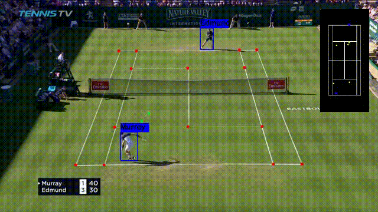
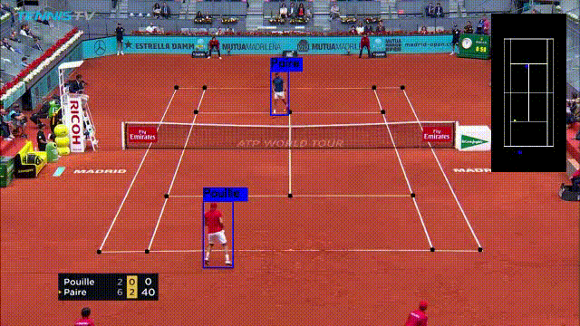

# TennisProject
Tennis analysis using deep learning and machine learning.  
You can check this blog post https://medium.com/@kosolapov.aetp/tennis-analysis-using-deep-learning-and-machine-learning-a5a74db7e2ee for more details

### Ball detection
TrackNet was used for detecting tennis ball during the game. For more information you can check this repository: https://github.com/yastrebksv/TrackNet. There you can find 
pretrained weights to check the model.

### Bounce detection
CatBoostRegressor was used to predict ball's bounces during the game based on ball trajectory detected in the previous step. You can check this pretrained model: https://drive.google.com/file/d/1Eo5HDnAQE8y_FbOftKZ8pjiojwuy2BmJ/view?usp=drive_link 

### Court detection
It was used neural network for detection 14 points of tennis court. For more information you can check this repository: https://github.com/yastrebksv/TennisCourtDetector. There you can find pretrained weights to check the model.

### How to run
Prepare a video file with resolution 1280x720
1. Clone the repository `https://github.com/yastrebksv/TennisProject.git`
2. Run `pip install -r requirements.txt` to install packages required
3. Run `python main.py <args>`

   

